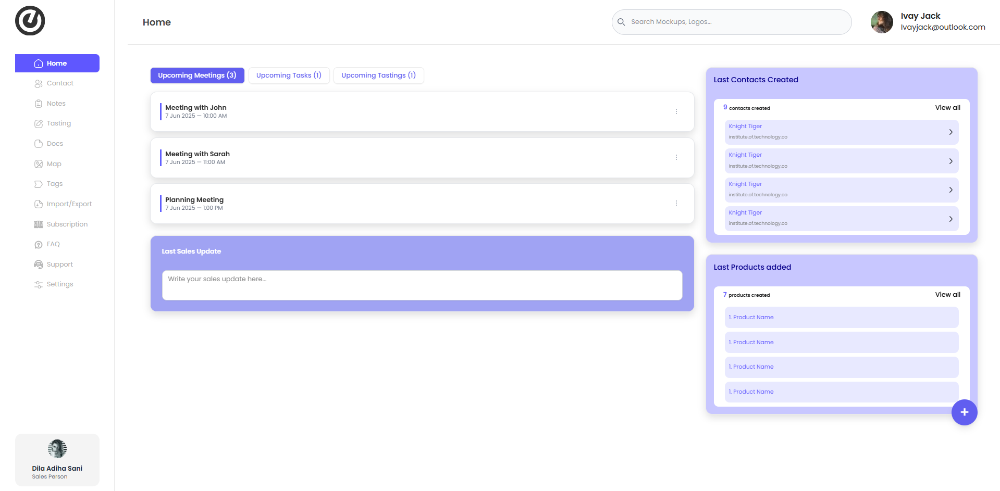

# Thibaud BDX Dashboard 🌐

Welcome to **ThibaudBDX**, a modern and elegant dashboard built to streamline business workflows and display key insights — fast, clean, and user-focused.

🌍 [Live Demo](https://thibaudbdx.vercel.app)

---

## ✨ Features

- 🔐 **Secure Auth Flow** – Login/signup with protected routing
- 📊 **Dashboard Insights** – Meetings, tasks, tasting schedules, and more
- 🗂 **Data Cards** – Last Contacts, Products Added, and Sales Update
- 📝 **Interactive Notes** – Add or update last sales notes using a clean UI
- 🧱 **Responsive Layout** – Built with Tailwind CSS Grid & Flexbox
- 🎨 **Modern Design** – ShadCN components with custom styling
- ⚡ **Performance-First** – Deployed on Vercel for blazing speed

---

## 🛠 Tech Stack

| Technology     | Usage                    |
|----------------|--------------------------|
| React          | Frontend Framework       |
| Vite/Next.js   | Fast build & routing     |
| Tailwind CSS   | Utility-first Styling    |
| ShadCN UI      | Pre-styled UI Components |
| Lucide Icons   | Icon set integration     |
| Vercel         | Deployment Platform      |

---

## 📸 Screenshots

 <!-- Update if needed -->

---

## 🚀 Getting Started

Clone the repo and install dependencies:

```bash
git clone https://github.com/your-username/thibaudbdx.git
cd thibaudbdx
pnpm install # or npm install / yarn install

📬 Feedback
Found a bug or have a feature request?

Open an issue
Submit a PR


🧑‍💻 Author
Made with ❤️ by Md.Tofayel Islam

